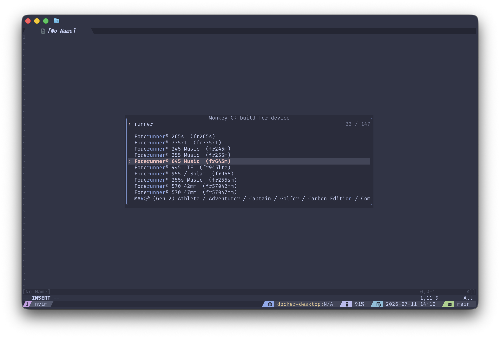
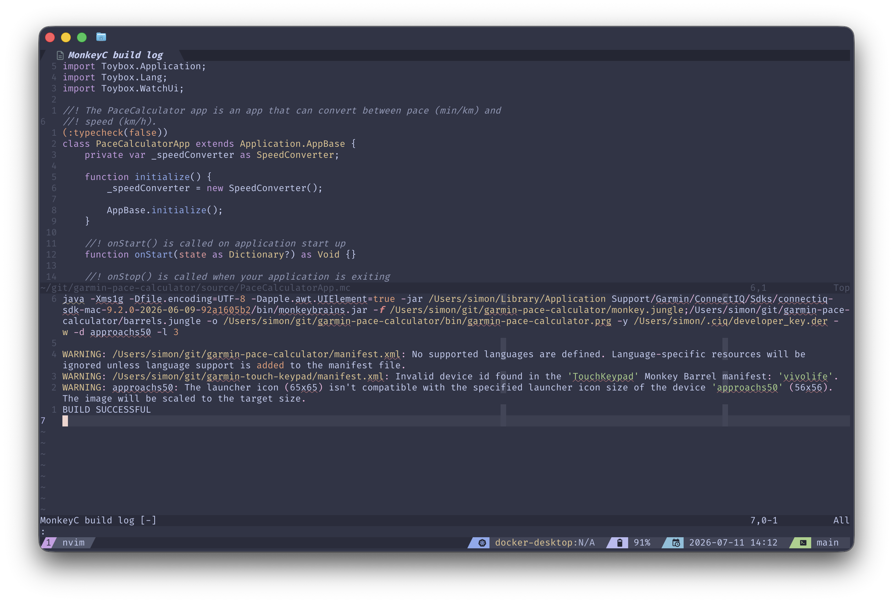
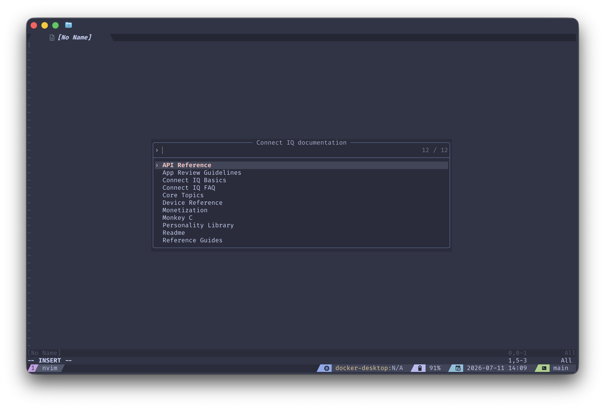
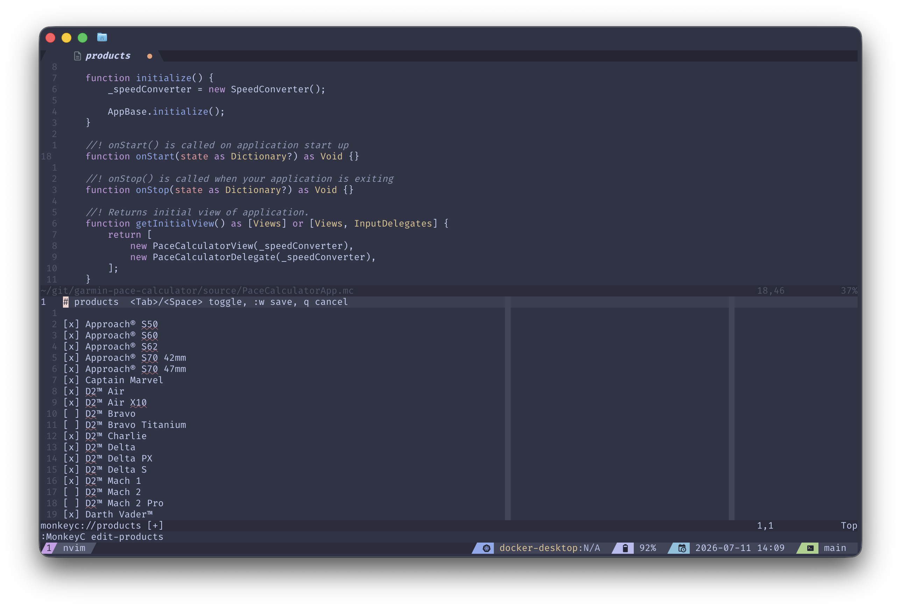
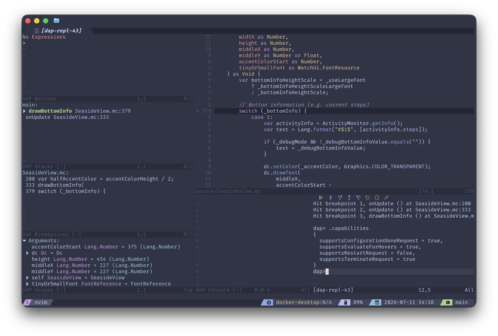
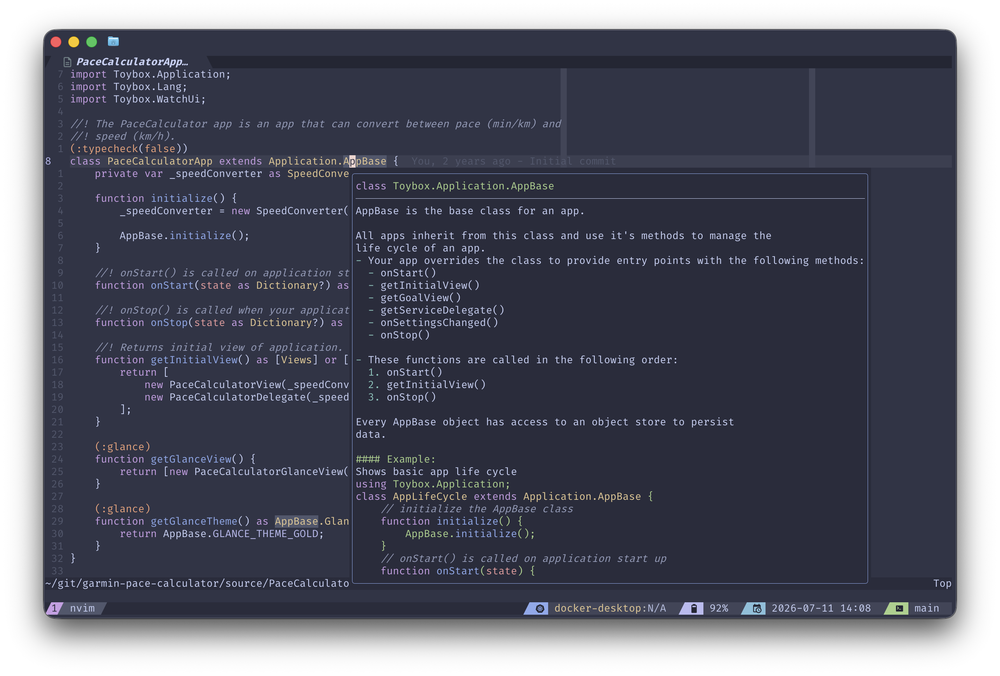

# garmin-monkeyc.nvim

Neovim port of the [official Monkey C VS Code extension][vscode]. Where it can it
runs the same [Connect IQ SDK][ciq] code the extension does: the language server
(`LanguageServer.jar`) and the debug adapter (`DebugAdapterProtocol` in
`monkeybrains.jar`) are Garmin's own binaries, and build, run, test, debug and
export all call the same compiler. A few commands are instead reimplemented in
Lua (marked ⚙️ below), since they are just file, XML or `openssl` work.

## Feature parity

Tracking the [VS Code extension][vscode].

- [x] Language server: hover, completion, goto-definition, references, rename,
      symbols, folding, call/type hierarchy (see [LSP](#lsp))
- [x] Syntax highlighting: bundled Vim syntax for `.mc`/`.mb`/`.mcgen`,
      `.jungle`, and `.mss`, ported from the VS Code TextMate grammars. ⚙️
      [tree-sitter-monkey-c] is recommended for higher fidelity (plus folds and
      text objects); the bundled syntax is a zero-setup fallback used when no
      tree-sitter parser is active.
- [x] Build for device - `:MonkeyC build-for-device [device]`
- [x] Build current project - `:MonkeyC build`
- [x] Run in simulator - `:MonkeyC run [device]`
- [x] Run unit tests - `:MonkeyC test [device]`
- [x] Debug (DAP) - `:MonkeyC debug [device]` (needs [nvim-dap])
- [x] Clean project - `:MonkeyC clean` ⚙️
- [x] Export `.iq` for the Connect IQ Store - `:MonkeyC export [path]`
- [x] New project - `:MonkeyC new-project [dir]` ⚙️
- [x] Generate a developer key - `:MonkeyC generate-key [path]` ⚙️
- [x] Edit manifest - `:MonkeyC edit-products` / `edit-permissions` /
      `edit-languages` / `edit-annotations` / `edit-application` ⚙️
- [x] Regenerate UUID - `:MonkeyC regenerate-uuid` ⚙️
- [x] Verify installation - `:checkhealth garmin-monkeyc` ⚙️
- [x] Open SDK Manager - `:MonkeyC sdk-manager`
- [x] View docs / open samples - `:MonkeyC docs` / `:MonkeyC samples`
- [x] External tools - `:MonkeyC monkey-graph` / `monkey-motion` / `era`
- [x] Native pairing - `:MonkeyC debug-native-pairing [device]`
- [x] Complication launch - `:MonkeyC debug-complication [device]`
- [x] Configure barrel - `:MonkeyC configure-barrel [path]` ⚙️

⚙️ reimplemented locally (in Lua, or a bundled Vim syntax file); everything else
drives the SDK's own binaries, the same code the VS Code extension runs.

## Requirements

- Neovim 0.11+ (uses `vim.lsp.config` / `vim.lsp.enable`).
- A [Connect IQ SDK][ciq] installed via the SDK Manager, with at least one device
  downloaded.
- `java` on `PATH`.
- [nvim-dap] for `:MonkeyC debug` (optional).

The SDK location is detected per OS. Override it with `sdk_path` if yours differs.

| OS          | default `Sdks` directory                                  |
| ----------- | --------------------------------------------------------- |
| macOS       | `$HOME/Library/Application Support/Garmin/ConnectIQ/Sdks` |
| Windows     | `$APPDATA/Garmin/ConnectIQ/Sdks`                          |
| Linux/other | `$HOME/.Garmin/ConnectIQ/Sdks` (no official SDK Manager)  |

## Installation

With [lazy.nvim]:

```lua
{
  "bombsimon/garmin-monkeyc.nvim",
  ft = "monkeyc",
  config = function()
    require("garmin-monkeyc").setup({
      capabilities = require("cmp_nvim_lsp").default_capabilities(),
      on_attach = my_on_attach,
      type_check_level = "Default", -- Default | Off | Gradual | Informative | Strict
      optimization_level = "Default", -- Default | None | Basic | Fast | Slow
      function_completion = "snippet", -- "snippet" (cursor inside ()) | "strip"
      sdk_path = nil, -- SDK path, set if not in the OS default
      device = nil, -- device id for type-checking (leave blank unless needed)
      developer_key = "~/.garmin/developer_key.der",
    })
  end,
}
```

The plugin registers `.mc` as filetype `monkeyc` via `ftdetect/`. Without it,
Neovim detects `.mc` as `m4`.

## Configuration

| option                | default     | meaning                                                                                          |
| --------------------- | ----------- | ------------------------------------------------------------------------------------------------ |
| `capabilities`        | `nil`       | base LSP client capabilities, merged with the plugin's overrides                                 |
| `on_attach`           | `nil`       | called when the server attaches to a buffer                                                      |
| `type_check_level`    | `"Default"` | `Default`, `Off`, `Gradual`, `Informative`, `Strict`                                             |
| `optimization_level`  | `"Default"` | compiler `-O` level: `Default`, `None`, `Basic`, `Fast`, `Slow` (`Default` omits `-O`)           |
| `function_completion` | `"snippet"` | `"snippet"` puts the cursor inside `name()` (needs a snippet engine), `"strip"` uses `name`      |
| `sdk_path`            | per-OS      | the `Sdks` directory (see [Requirements](#requirements))                                         |
| `device`              | `nil`       | device id for type-checking, leave unset unless you need it                                      |
| `developer_key`       | `nil`       | path to the `.der` key used to sign builds                                                       |
| `rename_skip_prepare` | `false`     | skip `prepareRename` so rename works even when the workspace has errors (see [LSP.md][lsp-docs]) |

## Commands

| command                                  | action                                                         |
| ---------------------------------------- | -------------------------------------------------------------- |
| `:MonkeyC build`                         | build `bin/<project>.prg` for the default device (no prompt)   |
| `:MonkeyC build-for-device [device]`     | build `bin/<project>.prg` for `device`                         |
| `:MonkeyC run [device]`                  | build, launch the simulator, and push the app to it            |
| `:MonkeyC test [device]`                 | build unit tests (`-t`) and run them in the simulator          |
| `:MonkeyC debug [device]`                | build, start the simulator, and debug via DAP (needs nvim-dap) |
| `:MonkeyC debug-native-pairing [device]` | debug in sensor (ANT/BLE) native pairing mode                  |
| `:MonkeyC debug-complication [device]`   | debug a complication publisher and subscriber together         |
| `:MonkeyC export [path]`                 | package a `.iq` for the store (all products, release)          |
| `:MonkeyC generate-key [path]`           | generate a developer key (RSA 4096, PKCS8 DER) via openssl     |
| `:MonkeyC new-project [dir]`             | scaffold a new project from an SDK template (prompts)          |
| `:MonkeyC regenerate-uuid`               | give the manifest a fresh application id                       |
| `:MonkeyC edit-products`                 | choose the manifest's target devices                           |
| `:MonkeyC edit-permissions`              | edit the manifest's permissions                                |
| `:MonkeyC edit-languages`                | choose the manifest's languages                                |
| `:MonkeyC edit-annotations`              | edit the manifest's annotations                                |
| `:MonkeyC edit-application`              | edit application type and minimum API level                    |
| `:MonkeyC configure-barrel [path]`       | add, update, or remove a Monkey Barrel dependency              |
| `:MonkeyC clean`                         | remove the `bin/` build output directory                       |
| `:MonkeyC diagnostics`                   | open all diagnostics in the quickfix                           |
| `:MonkeyC logs`                          | open the last build's full output in a split                   |
| `:MonkeyC cancel`                        | stop the running build                                         |
| `:MonkeyC sdk-manager`                   | open the Connect IQ SDK Manager                                |
| `:MonkeyC docs`                          | pick a bundled SDK doc (API reference, guides) to open         |
| `:MonkeyC samples`                       | open the SDK's samples directory                               |
| `:MonkeyC monkey-graph`                  | launch Monkey Graph (FIT graphing)                             |
| `:MonkeyC monkey-motion`                 | launch Monkey Motion                                           |
| `:MonkeyC era`                           | launch the ERA viewer                                          |

A few things to know:

- `:MonkeyC build` uses the `device` option, falling back to the first product in
  `manifest.xml`. Commands that take `[device]` prompt when it is omitted, using
  `vim.ui.select`. Any ui-select frontend ([telescope-ui-select], [dressing.nvim],
  [snacks.nvim]) turns that into a fuzzy picker, and device ids tab-complete on
  the command line.
- Builds stream progress on the command line. `export` packages every product, so
  you get `exporting (42/234 devices)`. Full output is kept for `:MonkeyC logs`,
  and errors go to the quickfix list.
- `Strict` type checking maps to the compiler's `-l 3`, so a `Strict` build fails
  on type errors.
- Building needs a developer key. Set `developer_key`, or run `:MonkeyC generate-key`
  (needs `openssl`) to create one.

<table>
  <tr>
    <td width="50%"></td>
    <td width="50%"></td>
  </tr>
  <tr>
    <td><i>Build for device select, with Telescope and fuzzy searching</i>
    <td><i>Build logs shown after a build</i>
  </tr>
  <tr>
    <td width="50%"></td>
    <td width="50%"></td>
  </tr>
  <tr>
    <td><i>Documentation selection, with Telescope and fuzzy searching</i>
    <td><i>Editing the manifest's target devices.</i>
  </tr>
</table>

> [!TIP]
> The screenshots uses [tree-sitter-monkey-c] for syntax highlighting.

## Debugging (DAP)



`:MonkeyC debug [device]` starts a debug session with [nvim-dap]. The SDK ships
a standard debug adapter (a Java DAP server in `monkeybrains.jar`), so the
plugin just wires it up. It builds a non-release build, starts the simulator,
waits for its debug port, and hands off to nvim-dap. Breakpoints, stepping, the
call stack, variables, and expression evaluation all work through nvim-dap.

`:MonkeyC debug-native-pairing [device]` is the same flow run in sensor native
pairing mode, for apps and data fields that pair with ANT/BLE sensors through a
`SensorDelegate`.

`:MonkeyC debug-complication [device]` debugs a complication publisher and
subscriber together (the watch face reads data the publisher app provides). Run
it from either project. If the current project is a watch face it is the
subscriber and you are prompted for the publisher app, otherwise it is the
publisher and you are prompted for the watch face. Both are built and loaded
into the simulator, with the watch face as the primary debug target. Getting
values to actually flow in the simulator has some non-obvious steps; see
[DAP.md][dap-docs].

nvim-dap is optional. Everything else works without it, and the adapter registers
only when nvim-dap is present. Debugging needs an SDK >= 2.3.0. Variables are
read-only, since the adapter has no `setVariable`. See [DAP.md][dap-docs] for how
the adapter works and what it supports.

## LSP



The bundled `LanguageServer.jar` does not work with a stock LSP client, so the
plugin:

- Discovers the newest installed SDK's `LanguageServer.jar`.
- Works around the server's `initialize` crash (it calls `.booleanValue()` on
  client capabilities it never null-checks).
- Builds the `workspaceSettings` the server needs before it resolves anything
  (project path, jungle files, type check level, device).
- Cleans the server's HTML hover into Markdown.
- Rewrites `name()` completions into `name($0)` snippets so the cursor lands
  between the parens.
- Answers the server's non-standard `custom/save` request so rename works (it
  gates on workspace errors; see [LSP.md][lsp-docs]).

Two features need a mapping because the server is non-standard. Both fall back to
the builtin when no Monkey C client is attached, so they are safe to map globally:

```lua
-- HTML hover cleaned to Markdown
vim.keymap.set("n", "K", require("garmin-monkeyc").hover)
-- signature help (the server errors without a context)
vim.keymap.set({ "n", "i" }, "<C-k>", require("garmin-monkeyc").signature_help)
```

Capabilities:

| Feature                                                                     | Support |
| --------------------------------------------------------------------------- | :-----: |
| definition, declaration, typeDefinition, implementation                     |   ✅    |
| references                                                                  |   ✅    |
| documentHighlight                                                           |   ✅    |
| documentSymbol, workspaceSymbol                                             |   ✅    |
| foldingRange                                                                |   ✅    |
| callHierarchy                                                               |   ✅    |
| typeHierarchy                                                               |   ✅    |
| hover                                                                       |   ⚙️    |
| signatureHelp                                                               |   ⚙️    |
| completion                                                                  |   ⚙️    |
| rename                                                                      |   ⚙️    |
| codeAction, formatting, semanticTokens, inlayHint, codeLens, executeCommand |   ❌    |

- ✅ works with a stock client
- ⚙️ needs a plugin workaround (see above)
- ❌ not implemented by the server

For the LSP internals, see [LSP.md][lsp-docs].

## Formatting

The language server does not format Monkey C. For that, use
[prettier-plugin-monkeyc] by @markw65, a Prettier plugin for the language. Huge
kudos to that project.

Install Prettier and the plugin (globally once is fine), e.g:

```sh
npm install -g prettier @markw65/prettier-plugin-monkeyc
```

Then point your formatter runner at it. For example with [none-ls]:

```lua
local null_ls = require("null-ls")

-- Resolve the global plugin once. Prettier can't load a global plugin by name,
-- so --plugin gets the absolute path to its built .cjs.
local monkeyc_plugin = vim.trim(vim.fn.system({ "npm", "root", "-g" }))
  .. "/@markw65/prettier-plugin-monkeyc/build/prettier-plugin-monkeyc.cjs"

null_ls.setup({
  sources = {
    null_ls.builtins.formatting.prettier.with({
      name = "prettier_monkeyc",
      extra_filetypes = { "monkeyc" },
      extra_args = { "--plugin", monkeyc_plugin },
    }),
  },
})
```

Passing `--plugin` on every Prettier run is harmless; Prettier only uses the
Monkey C parser for `.mc` files. The `monkeyc` filetype comes from this plugin's
`ftdetect`.

## Health check

`:checkhealth garmin-monkeyc` reports the SDK and version, the toolchain
(`LanguageServer.jar`, `monkeyc`, `monkeydo`, `connectiq`), `java`, the installed
device count, the developer key, the DAP adapter, and whether the language server
is attached.

[ciq]: https://developer.garmin.com/connect-iq/overview/
[dap-docs]: ./DAP.md
[dressing.nvim]: https://github.com/stevearc/dressing.nvim
[lazy.nvim]: https://github.com/folke/lazy.nvim
[lsp-docs]: ./LSP.md
[nvim-dap]: https://github.com/mfussenegger/nvim-dap
[none-ls]: https://github.com/nvimtools/none-ls.nvim
[prettier-plugin-monkeyc]: https://github.com/markw65/prettier-plugin-monkeyc
[snacks.nvim]: https://github.com/folke/snacks.nvim
[telescope-ui-select]: https://github.com/nvim-telescope/telescope-ui-select.nvim
[vscode]: https://marketplace.visualstudio.com/items?itemName=garmin.monkey-c
[tree-sitter-monkey-c]: https://github.com/bombsimon/tree-sitter-monkey-c
